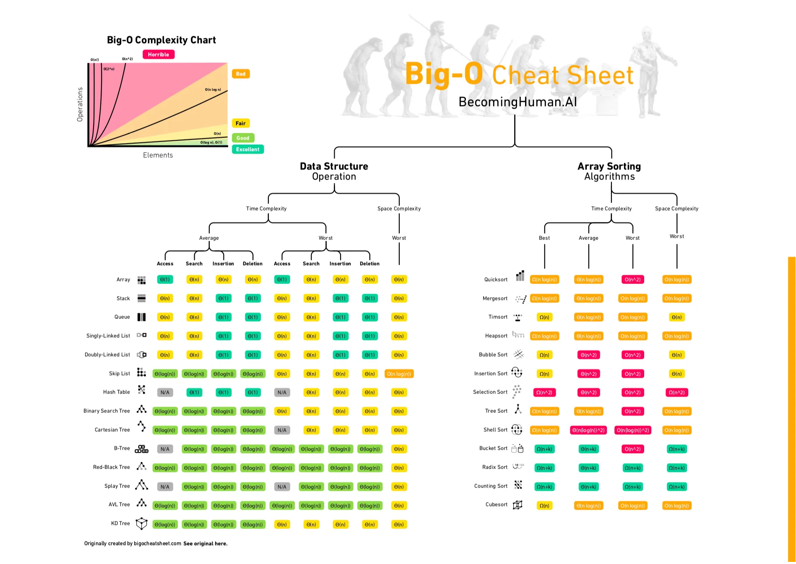
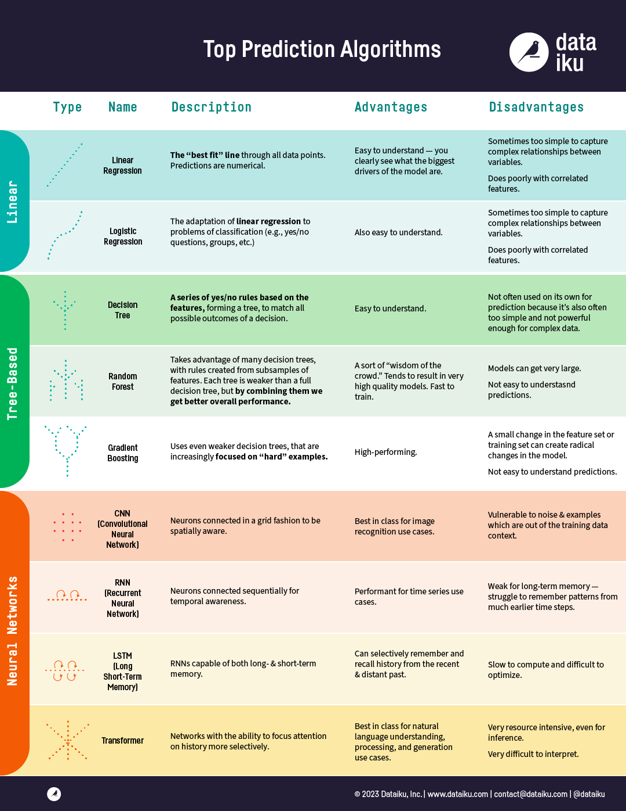

# Useful code for various python packages

- matplotlib
- pandas [in progress]
- numpy [in progress]
- scikit-learn

---

Great lists of cheatsheets and resources:

- https://medium.com/machine-learning-in-practice/cheat-sheet-of-machine-learning-and-python-and-math-cheat-sheets-a4afe4e791b6
- https://medium.com/bitgrit-data-science-publication/a-roadmap-to-learn-ai-in-2024-cc30c6aa6e16
- https://github.com/jacobhilton/deep_learning_curriculum?tab=readme-ov-file
