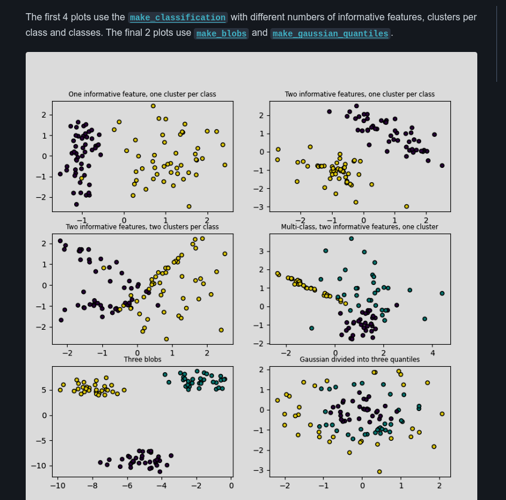

# Scikit-learn Generated Datasets Cheatsheet

## 1. make_classification

**When to use:**

- Generate a random n-class classification problem
- Useful for testing classification algorithms

**Dataset type:** Classification

**Example:**

```python
from sklearn.datasets import make_classification

X, y = make_classification(n_samples=100, n_features=20, n_classes=2,
                           n_clusters_per_class=1, random_state=42)
```

## 2. make_blobs

**When to use:**

- Generate isotropic Gaussian blobs for clustering
- Useful for testing clustering algorithms

**Dataset type:** Clustering

**Example:**

```python
from sklearn.datasets import make_blobs

X, y = make_blobs(n_samples=100, n_features=2, centers=3, random_state=42)
```



## 3. make_regression

**When to use:**

- Generate a random regression problem
- Useful for testing regression algorithms

**Dataset type:** Regression

**Example:**

```python
from sklearn.datasets import make_regression

X, y = make_regression(n_samples=100, n_features=1, noise=0.1, random_state=42)
```


## 4. make_circles

**When to use:**

- Generate a large circle containing a smaller circle in 2d
- Useful for testing non-linear clustering algorithms

**Dataset type:** Clustering

**Example:**

```python
from sklearn.datasets import make_circles

X, y = make_circles(n_samples=100, noise=0.05, factor=0.5, random_state=42)
```

## 5. make_moons

**When to use:**

- Generate two interleaving half circles
- Useful for testing non-linear clustering algorithms

**Dataset type:** Clustering

**Example:**

```python
from sklearn.datasets import make_moons

X, y = make_moons(n_samples=100, noise=0.1, random_state=42)
```

## 6. make_multilabel_classification

**When to use:**

- Generate a random multilabel classification problem
- Useful for testing multi-label classification algorithms

**Dataset type:** Multi-label Classification

**Example:**

```python
from sklearn.datasets import make_multilabel_classification

X, y = make_multilabel_classification(n_samples=100, n_features=20,
                                      n_classes=3, n_labels=2,
                                      random_state=42)
```

## 7. make_biclusters

**When to use:**

- Generate a random biclustering problem
- Useful for testing biclustering algorithms

**Dataset type:** Biclustering

**Example:**

```python
from sklearn.datasets import make_biclusters

X, rows, cols = make_biclusters((100, 100), n_clusters=3, random_state=42)
```

## 8. make_friedman1

**When to use:**

- Generate the "Friedman #1" regression problem
- Useful for testing regression algorithms

**Dataset type:** Regression

**Example:**

```python
from sklearn.datasets import make_friedman1

X, y = make_friedman1(n_samples=100, noise=0.1, random_state=42)
```

## 9. make_s_curve

**When to use:**

- Generate an S curve dataset
- Useful for testing non-linear dimensionality reduction algorithms

**Dataset type:** Manifold learning

**Example:**

```python
from sklearn.datasets import make_s_curve

X, t = make_s_curve(n_samples=100, noise=0.1, random_state=42)
```

## 10. make_sparse_uncorrelated

**When to use:**

- Generate a random regression problem with sparse uncorrelated design
- Useful for testing regression algorithms with sparse input

**Dataset type:** Regression

**Example:**

```python
from sklearn.datasets import make_sparse_uncorrelated

X, y = make_sparse_uncorrelated(n_samples=100, n_features=10, random_state=42)
```

Remember that all these functions have various parameters to customize the generated datasets. Always check the scikit-learn documentation for the full list of parameters and their meanings.

Also, setting `random_state` ensures reproducibility of the generated datasets.
